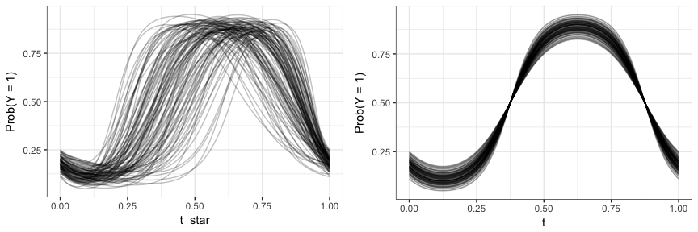
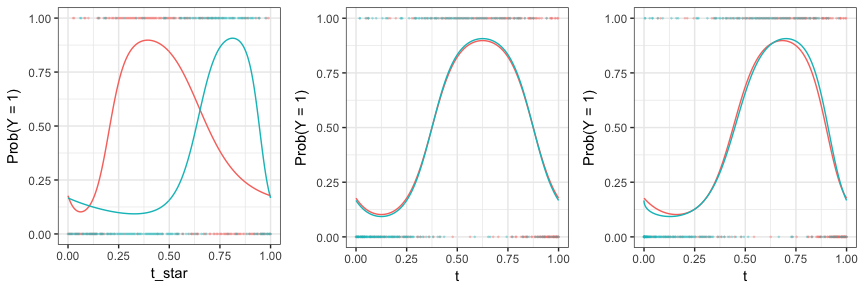

<!-- README.md is generated from README.Rmd. Please edit that file -->
`registr`
=========

[](https://travis-ci.org/julia-wrobel/registr)

Registration for exponential family functional data.

-   Authors: [Julia Wrobel](http://juliawrobel.com) and [Jeff Goldsmith](http://jeffgoldsmith.com)
-   License: [MIT](https://opensource.org/licenses/MIT). See the [LICENSE](LICENSE) file for details
-   Version: 0.1

### What it does

------------------------------------------------------------------------

Functional data analysis deals with understanding patterns and variability in data where the basic unit of observation is a curve measured over some domain such as time or space. For an example of functional data consider an accelerometer study where intensity of physical activity was measured at each minute over 24 hours for 50 subjects. The data will contain 50 curves, where each curve is the 24-hour activity profile for a particular subject.

Classic functional data analysis assumes that each curve is continuous or comes from a Gaussian distribution. However, applications with exponential family functional data- curves that arise from any exponential family distribution, and have a smooth latent mean- are increasingly common. For example, take the accelerometer data just mentioned, but instead of *activity intensity* the researchers were interested in sedentary behavior, and at each minute over 24 hours collect a binary measurement that indicates whether a subject was active or inactive. This would be considered exponential family functional data. Specifically, binary functional data.

Often in a functional dataset curves have similar underlying patterns but the main features of each curve, such as minimum and maximum, have shifts such that the data appear misaligned. This misalignment can obscure patterns shared across curves and produce messy summary statistics. Registration methods reduce variability in functional data and clarify underlying patterns by alligning curves.

This package implements a statistical method for registering exponential family functional data. The method is described in more detail [here](). We provide instructions for installing the software and using it to register simulated binary data below.

### Installation

------------------------------------------------------------------------

To install the latest version directly from Github, please use:

``` r
install.packages("devtools")
devtools::install_github("julia-wrobel/registr", build_vignettes = TRUE)
```

### How to use it

------------------------------------------------------------------------

This example highlights how to use the package for registering simulated binary data. More details on use of the package can be found in the package vignette.

The code below uses a function from our package to simulate curves for 100 subjects with 200 timepoints each, observed over domain (0, 1). All curves have similar structure but the location of the peak is shifted. On the observed domain *t*<sup>\*</sup> the curves are unregistered (misaligned). On the domain *t* the curves are registered (aligned).

``` r
library(registr)

registration_data = simulate_unregistered_curves(I = 100, D = 200, seed = 2018)
```

The plot below shows the unregistered curves and registered curves.



Continuously observed curves are shown above in order to illustrate the misalignment problem and our simulated data; the simulated dataset also includes binary values which have been generated by using these continuous curves as probabilities. The unregistered and registered binary curves for two subjects are shown below.


Our software registers curves by estimating *t*. For this we use the function `registration_fpca()`.

``` r
binary_registration = register_fpca(Y = registration_data, family = "binomial", 
                                                                Kt = 6, Kh = 3, npc  = 1)
## current iteration: 1
## current iteration: 2
## current iteration: 3
```

The plot below shows unregistered, true registered, and estimated registered binary curves two subjects after fitting our method.


