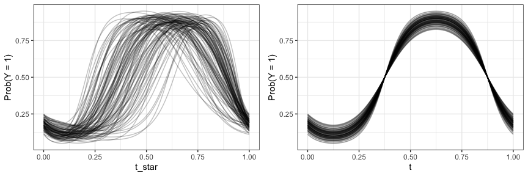
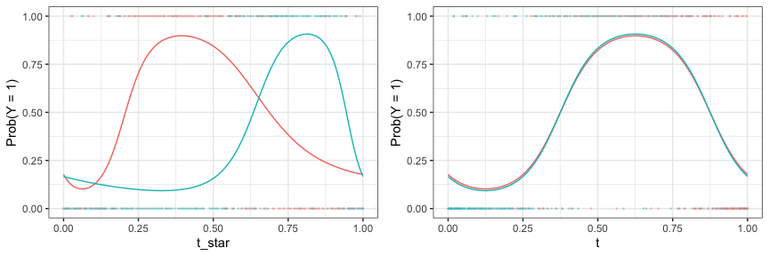
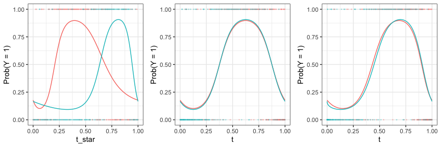

<!-- README.md is generated from README.Rmd. Please edit that file -->

# registr 

<!-- badges: start -->
[](https://travis-ci.org/julia-wrobel/registr)
[](https://ci.appveyor.com/project/muschellij2/registr)
[](https://codecov.io/gh/julia-wrobel/registr/coverage.svg?branch=master)
[](http://joss.theoj.org/papers/9c40c4f0ede1827cc5a9430c625d6494)
<!-- badges: end -->

Registration for exponential family functional data.

  - Author: [Julia Wrobel](http://juliawrobel.com)
  - License: [MIT](https://opensource.org/licenses/MIT). See the
    [LICENSE](LICENSE) file for details
  - Version: 1.0

### What it does

-----

Functional data analysis is a set of tools for understanding patterns
and variability in data where the basic unit of observation is a curve
measured over some domain such as time or space. An example is an
accelerometer study where intensity of physical activity was measured at
each minute over 24 hours for 50 subjects. The data will contain 50
curves, where each curve is the 24-hour activity profile for a
particular subject.

Classic functional data analysis assumes that each curve is continuous
or comes from a Gaussian distribution. However, applications with
exponential family functional data – curves that arise from any
exponential family distribution, and have a smooth latent mean – are
increasingly common. For example, take the accelerometer data just
mentioned, but assume researchers are interested in *sedentary behavior*
instead of *activity intensity*. At each minute over 24 hours they
collect a binary measurement that indicates whether a subject was active
or inactive (sedentary). Now we have a *binary curve* for each subject –
a trajectory where each time point can take on a value of 0 or 1. We
assume the binary curve has a smooth latent mean, which in this case is
interpreted as the probability of being active at each minute over 24
hours. This is a example of exponential family functional data.

Often in a functional dataset curves have similar underlying patterns
but the main features of each curve, such as the minimum and maximum,
have shifts such that the data appear misaligned. This misalignment can
obscure patterns shared across curves and produce messy summary
statistics. Registration methods reduce variability in functional data
and clarify underlying patterns by aligning curves.

This package implements statistical methods for registering exponential
family functional data. The methods are described in more detail in our
[paper](http://juliawrobel.com/Downloads/registration_ef.pdf).
Instructions for installing the software and using it to register
simulated binary data are provided below.

### Installation

-----

To install the latest version directly from Github, please use:

``` r
install.packages("devtools")
devtools::install_github("julia-wrobel/registr")
```

The `registr` package includes a vignette with more details on package
use and functionality. To install the latest version and pull up the
vignette please use:

``` r
devtools::install_github("julia-wrobel/registr", build_vignettes = TRUE)
vignette(package = "registr")
```

### How to use it

-----

This example registers simulated binary data. More details on use of the
package can be found in the vignette mentioned above.

The code below uses `registr::simulate_unregistered_curves()` to
simulate curves for 100 subjects with 200 timepoints each, observed over
domain \((0, 1)\). All curves have similar structure but the location of
the peak is shifted. On the observed domain \(t^*\) the curves are
unregistered (misaligned). On the domain \(t\) the curves are registered
(aligned).

``` r
library(registr)

registration_data = simulate_unregistered_curves(I = 100, D = 200, seed = 2018)
```

The plot below shows the unregistered curves and registered
curves.



Continuously observed curves are shown above in order to illustrate the
misalignment problem and our simulated data; the simulated dataset also
includes binary values which have been generated by using these
continuous curves as probabilities. The unregistered and registered
binary curves for two subjects are shown
below.



Our software registers curves by estimating \(t\). For this we use the
function
`registration_fpca()`.

``` r
binary_registration = register_fpca(Y = registration_data, family = "binomial", 
                                                                Kt = 6, Kh = 3, npc  = 1)
## current iteration: 1
## current iteration: 2
## current iteration: 3
## current iteration: 4
```

The plot below shows unregistered, true registered, and estimated
registered binary curves for two subjects after fitting our
method.



### Citation

To cite this package with `BibTeX`, use

    @article{wrobel2018regis,
      title={registr: Registration for Exponential Family Functional Data},
      author={Wrobel, Julia},
      journal={The Journal of Open Source Software},
      volume={3},
      year={2018}
    }

### Contributions

-----

If you find small bugs, larger issues, or have suggestions, please file
them using the [issue
tracker](https://github.com/julia-wrobel/registr/issues) or email the
maintainer at <jw3134@cumc.columbia.edu>. Contributions (via pull
requests or otherwise) are welcome.
