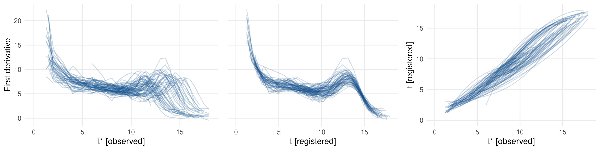

# Introduction

Functional data are observed in many different fields.
One classic example are longer-term panel studies where a sequence of measurements
is observed for each subject.
Compared to classical longitudinal studies and by analyzing the
observed _curve_ per subject, functional data analysis focuses more
on the shapes of the (time-dependent) processes.
E.g., one can analyze the speed of growth of children until adulthood
in the Berkeley child growth study (see left pane of Figure \autoref{fig:registration}).

Functional data comprise different modes of variation.
In the Berkeley study, not only can growth spurts be more or less pronounced
regarding the actual growth (i.e., _amplitude variation_ along the y-axis), but each spurt
can also be shifted for some months / years for individual subjects (i.e., _phase variation_ along the x-axis).
Even if focus is on amplitude variation, observed curves often have to be
preprocessed by a _registration method_ to eliminate phase variation.

Most registration methods can only handle continuous data or data with a gaussian
structure. However, functional data are often non-gaussian or even categorical.
E.g., each time point can comprise a binary indicator for physical (in)activity
of patients [@wrobel2019].
Moreover, most registration approaches are only applicable to completely observed curves that
comprise the underlying process from its very start to its very end.

# Exponential Family-based Registration

The `registr` package is based on the methods outlined in @wrobel2019.
Registration is performed using a likelihood-based approach and estimates
_inverse warping functions_ $h_i^{-1}: t_i^* \mapsto t$ that map the observed
time domain $t_i^*$ of subject $i$ to the common time domain $t$.
The overall model is

$$
\begin{aligned}
E\left[Y_i\left(h_i^{-1}(t_i^*)\right) | c_i, h_i^{-1} \right] &= \mu_i(t), \\
g\left[\mu_i(t)\right] &= \alpha(t) + \sum_{k = 1}^K c_{ik}\psi_k(t),
\end{aligned}
$$

with $Y_i\left(t_i^*\right)$ and $Y_i\left(h_i^{-1}(t_i^*)\right)$ the unregistered and registered curves, respectively,
and $\mu_i(t)$ the subject-specific means.
The latter are expressed through a lower-dimensional representation based on
a population-level mean $\alpha(t)$ and a linear combination of population-level basis functions $\psi_k(t)$
and subject-specific scores $\boldsymbol{c}_i$, given some link function $g(\cdot)$.
We estimate this representation using a likelihood-based
approach for generalized functional principal component analysis (GFPCA).

The overall model is estimated with function `register_fpca()`, which iterates 
between the estimation of warping
functions for the registration step (implemented in function `registr()`)
and GFPCA estimation (functions `fpca_gauss()` or `bfpca()` for gaussian or binomial data, respectively).
The GFPCA functions are partly implemented in C++ using R packages `Rcpp` and `RcppArmadillo` [@rcpp; @rcppArma]
to enhance computational efficiency.
The package also includes an implementation of the _two-step GFPCA_ approach
of @gertheiss2017 to also handle further exponential family distributions.
The respective implementation is based on the `gfpca` package of @goldsmith2016.

Various exponential family distributions are supported both for the registration and GFPCA approaches.
For the registration step, the template function (to which all curves are mapped)
can be flexibly defined by the user with the argument `Y_template` in `registr()` and `register_fpca()`.
Final results can be interactively visualized with the `refund.shiny` package [@refund.shiny; @wrobel2016]. 

# Incomplete Curve Registration

We extend the approach of @wrobel2019 to
incomplete curves where the underlying process was either not observed
from its very beginning (i.e., _leading incompleteness_) or until its very end
(_trailing incompleteness_), or both (_full incompleteness_).

Given that for complete curves the underlying process is fully comprised in the observed
interval, it is reasonable to assume that both the starting points and the
endpoints of the warping functions lie on the diagonal line (i.e., resemble an identity map) to preserve the overall interval.
For incomplete curves, warping functions are estimated without this
starting point and / or endpoint constraint.

However, fully removing these constraints can lead to extreme distortions
of the time domain.
We include a penalization parameter $\lambda$ that controls how strongly
the starting points / endpoints can differ from the diagonal line.
In practical settings, $\lambda$ has to be set manually to specify which kinds of
warpings are deemed unrealistic and should be prevented.
The choice of $\lambda$ should be based on subject knowledge by comparing
the registration results given different $\lambda$ values.

Mathematically speaking, we add a penalization term to the log likelihood $\ell(i)$ [see @wrobel2019]
for curve $i$. For a setting with full incompleteness this results in

$$
\begin{aligned}
\ell_{pen}(i) &= \ell(i) - \lambda \cdot pen(i), \\
\text{with} \ \ \ 
pen(i) &= \left( \hat{h}^{-1}_i(t^*_{min,i}) - t^*_{min,i} \right)^2 +
\left( \hat{h}^{-1}_i(t^*_{max,i}) - t^*_{max,i} \right)^2,
\end{aligned}
$$

where $t^*_{min,i},t^*_{max,i}$ are the minimum / maximum of the observed time domain of curve $i$ and
$\hat{h}^{-1}_i(t^*_{min,i}), \hat{h}^{-1}_i(t^*_{max,i})$ the inverse warping function evaluated at this
minimum / maximum.

In `registr()` and `register_fpca()` the type of incompleteness can be defined
by argument `incompleteness`.
When applied to the Berkeley data with simulated full incompleteness,
our approach leads to a reasonable registration as shown in Figure \autoref{fig:registration}:

# Acknowledgements

We thank Fabian Scheipl and Helmut Küchenhoff for valuable methodological contributions.

# References