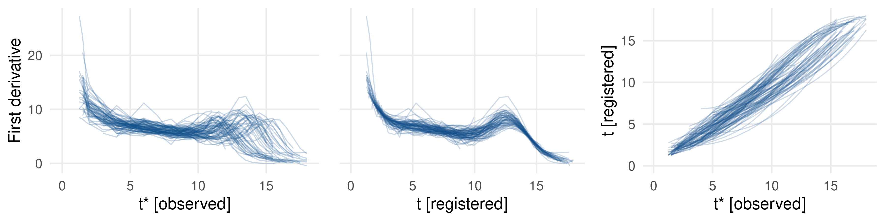

# Introduction

Functional data are observed in many different fields.
Typical examples are longer-term panel studies where a sequence of measurements
is observed for each subject.
Compared to classical longitudinal studies, functional data analysis focuses
more on the shapes of the (time-dependent) processes by analyzing the observed
curve per subject.
E.g., one can analyze the speed of growth of children until adulthood
in the Berkeley child growth study (see left pane of \autoref{fig:registration}).

Functional data comprise different modes of variation.
In the Berkeley study, not only can growth spurts be more or less pronounced
regarding the actual growth (i.e., _amplitude variation_ along the y-axis), but each spurt
can also be shifted for some months / years for individual subjects (i.e., _phase variation_ along the x-axis).
Observed curves often have to be preprocessed with a _registration method_ in
order to separate phase and amplitude variation before analysis.

Most registration methods can only handle continuous data or data with a Gaussian
structure. However, functional data are often non-Gaussian or even categorical.
E.g., function values could be binary indicators representing physical (in)activity of patients over time [@wrobel2019].
Moreover, most registration approaches are only applicable to completely observed curves that
comprise the underlying process from its very start to its very end.

Basic routines for registering (Gaussian) data are implemented in R package
[@R_fda]. Performing joint registration and clustering is possible with [@R_fdakma].
The popular square-root velocity function (SRVF) framework for curve registration is implemented in [@R_fdasrvf]
for completely observed curves on a regular grid. Similar to our approach the package
allows for registering all curves to similar shapes which can be well represented
by some low-rank basis.

# Exponential Family-based Registration

The `registr` package is based on the methods outlined in @wrobel2019.
Registration is performed using a likelihood-based approach and estimates
_inverse warping functions_ ${h_i^{-1}: t_i^* \mapsto t}$ that map the observed
time domain $t_i^*$ for subject $i$ to the common time domain $t$.
The overall model is

$$
\begin{aligned}
E\left[Y_i\left(h_i^{-1}(t_i^*)\right) | h_i^{-1}, \alpha(t), \boldsymbol{c}_i, \boldsymbol{\psi}(t) \right] &= \mu_i(t), \\
g\left[\mu_i(t)\right] &= \alpha(t) + \sum_{k = 1}^K c_{ik}\psi_k(t),
\end{aligned}
$$

with $Y_i\left(t_i^*\right)$ and $Y_i\left(h_i^{-1}(t_i^*)\right)$ the unregistered and registered curves, respectively,
and $\mu_i(t)$ the estimated subject-specific means serving as template functions, i.e., the target for the registration.
The assumed distribution with link function $g(\cdot)$ and this conditional expectation allow us to define a log-likelihood $\ell(i)$ for each observed function [see @wrobel2019].
The subject-specific means $\mu_i(t)$ are expressed through a low-rank representation based on
a population-level mean $\alpha(t)$ and a linear combination of population-level basis functions $\psi_k(t)$
and subject-specific scores $\boldsymbol{c}_i$, composed with a fixed link function $g(\cdot)$.
We estimate this representation using a likelihood-based
approach for generalized functional principal component analysis (GFPCA).

The overall model is estimated with function `register_fpca()`, which iterates 
between the estimation of warping
functions (implemented in function `registr()`)
and GFPCA estimation (functions `fpca_gauss()` or `bfpca()` for Gaussian or binomial data, respectively).
This approach is consistent with earlier versions of the `registr` package [compare @wrobel2018].

In version 2.0, the package now includes the _two-step GFPCA_ approach
of @gertheiss2017 to handle further exponential family distributions.
The respective implementation is based on the `gfpca` package of @goldsmith2016.
New distributions are supported both for registration and GFPCA.
Furthermore, for the registration step, the individual template functions (to which each curve is mapped)
can now be flexibly defined by the user with the argument `Y_template` in `registr()` and `register_fpca()`.
This is of relevance since in many settings the overall mean of the unregistered curves
is no reasonable template.

# Incomplete Curve Registration

We extend the approach of @wrobel2019 to
incomplete curves where the underlying process was either not observed
from its very beginning (i.e., _leading incompleteness_) or until its very end
(_trailing incompleteness_), or both (_full incompleteness_).

Since the underlying process is fully contained in the observed interval for complete curves, the first and last value of complete-curve warping functions lie on the diagonal line so that they preserve the overall domain.
For incomplete curves, warping functions are estimated without this
starting point and / or endpoint constraint.

However, fully removing these constraints can lead to extreme distortions
of the time domain.
We include a regularization term $\lambda$ that penalizes the amount of domain dilation
or compression performed by the inverse warping functions.
Mathematically speaking, we add a penalization term to the log likelihood $\ell(i)$
for curve $i$. For a setting with full incompleteness this results in

$$
\begin{aligned}
\ell_{\text{pen}}(i) &= \ell(i) - \lambda \cdot n_i \cdot \text{pen}(i), \\
\text{with} \ \ \ 
\text{pen}(i) &= \left( [\hat{h}_i^{-1}(t_{max,i}^*) - \hat{h}_i^{-1}(t_{min,i}^*)] - [t_{max,i}^* - t_{min,i}^*] \right)^2,
\end{aligned}
$$

where $t^*_{min,i},t^*_{max,i}$ are the minimum / maximum of the observed time domain of curve $i$ and
$\hat{h}^{-1}_i(t^*_{min,i}), \hat{h}^{-1}_i(t^*_{max,i})$ the inverse warping function evaluated at this
minimum / maximum.
For leading incompleteness with $h_i^{-1}(t_{max,i}^*) = t_{max,i}^* \forall i$ this simplifies to
$\text{pen}(i) = \left(\hat{h}_i^{-1}(t_{min,i}^*) - t_{min,i}^*\right)^2$, and for trailing incompleteness with
$h_i^{-1}(t_{min,i}^*) = t_{min,i}^* \forall i$ to
$\text{pen}(i) = \left(\hat{h}_i^{-1}(t_{max,i}^*) - t_{max,i}^*\right)^2$.
The penalization term is scaled by the number of measurements $n_i$ of curve $i$
to ensure a similar impact of the penalization for curves with different numbers
of measurements.
In practical settings, $\lambda$ has to be set manually to specify which kinds of
warpings are deemed unrealistic and should be prevented.
The choice of $\lambda$ should be based on subject knowledge by comparing
the registration results given different $\lambda$ values.

In `registr()` and `register_fpca()` the type of incompleteness can be defined
by argument `incompleteness`.
Further details are given in the package vignette _incomplete_curves_.
When applied to the Berkeley data with simulated full incompleteness,
our approach leads to a reasonable registration as shown in \autoref{fig:registration}.

# Acknowledgements

We thank Fabian Scheipl and Helmut Küchenhoff for valuable methodological contributions.

# References